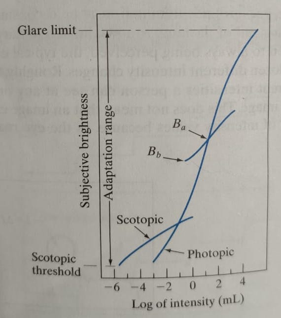
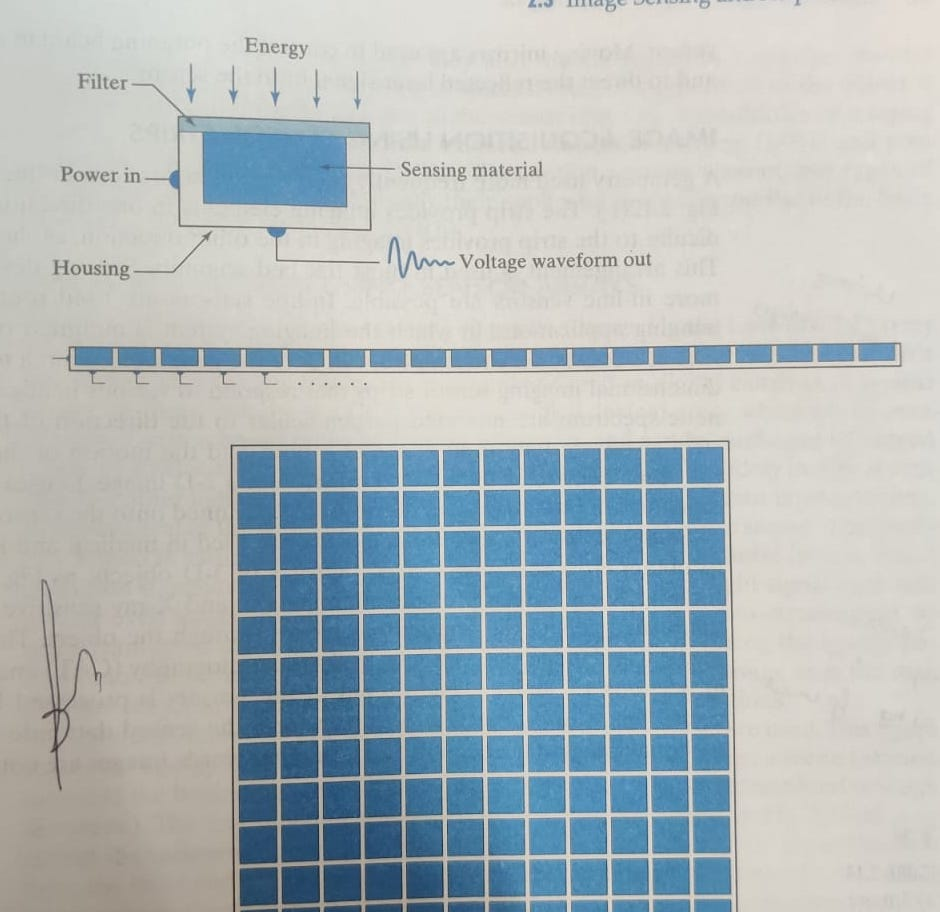
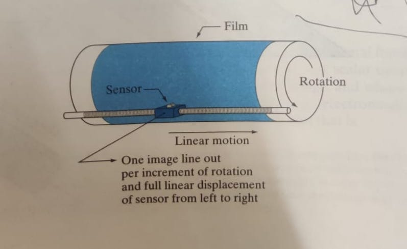
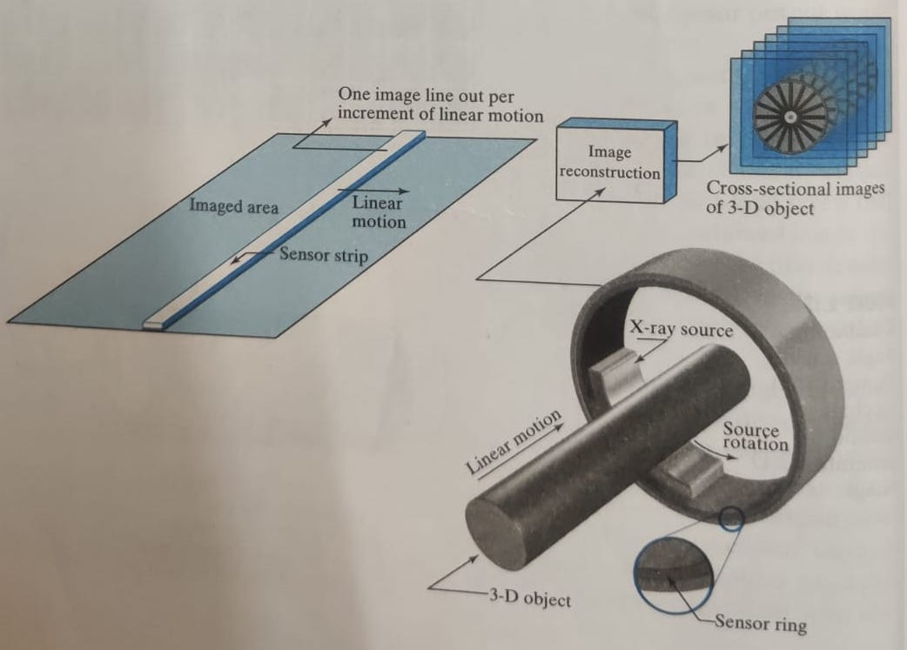
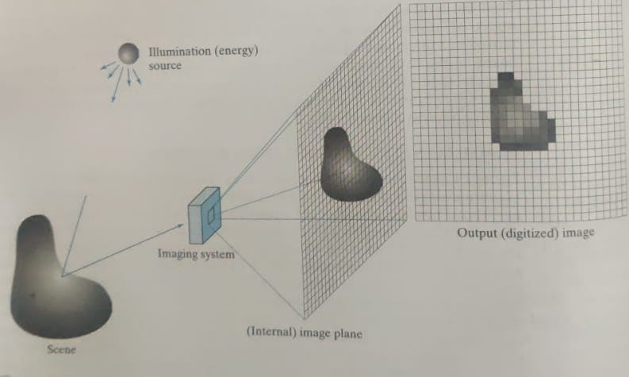
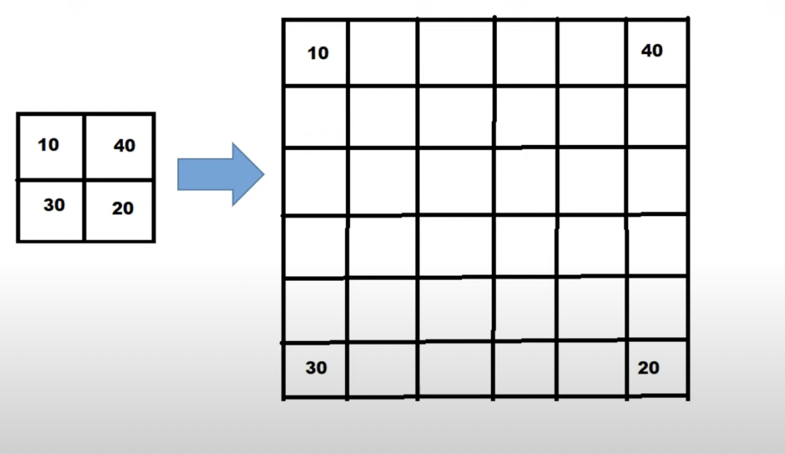
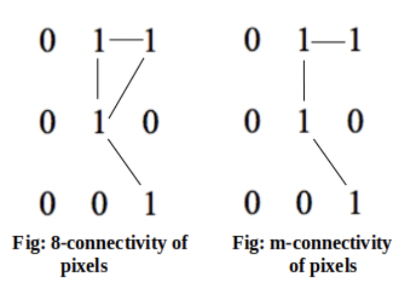

# Chapter-2 Digital Images Format 

## 2.1 - Elements of Visual Perception

28-01-2022 

### The Structure of the eye 
The eye is really a wonder of nature, so perfect it works, and I am going to start my new journey studying a bit about this beautiful machine. How humans percieve
vision is of a great interest to us. The human eye has 3 membrane structure, one of them is retina, which forms the part of the eye where the images are 
formed inside the eye. It percieves this image and sends the signal to the brain (how brilliant). 

The light perception happens in the **retina** region of the eye. which lines the inside walls of the poserior region. It has two types of receptors, cones and rods. It's also very interesting to see how these two acts as two dfferent types of receptors. 

 **Cones**
- There are about 6-7 million in numbers, mostly located in the central region of the retina (known as Fovea, also check the diagram below)/
- They are highly sensitive to the color. 
- Each cone is connected to a nerve end and hence they can resolve fine details of the scene. 
- Cone Vision is known as <i>photopic</i> or <i>bright light vision</i>.

**Rods**
- There are about 75 to 150 million rods present in each eye (yes, much much larger)
- They don;t have a separate nerve ending for each cell and several rods are connected to a single nerve ending, th is reduces the information that is carried forward and hence rods capture the overall image of the field of view. 
- They are not involved in color visoin and are sensitive to low levels of illumination. 
- Rods vision is known as <i>scotopic </i> or <i>dim-light </i>

"Objects that appear colored during the day, appear as colorless forms in the moonlight" and now you know why, because for the latter, only the rods are stimulated. 

Also, what I refer to it as, that rods and cones capture different qualities of the scene, cones is much more interested in capturing the color, brighness and hue of the scene, where rods capture the shapes, distance and other basic characterisitics of the scene. 

**Figure 2.2**
 

The above figure shows the density of cones and rods in the cross-section of the right eye. 
- The disitribution is almost symmetrical about Fovea (present at 0 degrees), but there is a point at around 20 degrees (left of Fovea in the figure) called the blind spot. This is the region where optic nerve is connected to the eye and hence, no receptors are present at this region. 
- The Fovea here represents a circular region in the retina and has an area of about 1.7 mm squares. 
- Cones are mostly located in the center area of fovea. 
- Rode are more uniformly located then cones, their density increases in density from center out to approximately  off axis. Then, their density decreases out to the periphery of the retina.

One interesting thing to note here is that the fovea contains about 265,000 cones. So, this much amount of ligh sensors. It's many isn't. But here comes the interesting thing, **Most electronic imaging chips exceed this number by a large factor**.

09-02-2022 

### Image Formation in the eye 
- There's a difference between how an ordinary photographic camera focusses on object to how an human eye would do it. 
- In case of a camera, the lens has a fixed focal lenght and the image is formed on the film (imaging chip, or retina of the camera) by varying the distance between the lens and the film. 
- However in the case of human eye, this distance is fixed (between the lens and retina). In this case, the image is formed on the retina by chanding the shape and hence the focal length of the lens is adjusted such that image is formed on the retian. 
- And this happens so effortlessly. If you are seeing the screen right now, and just look at the background (wall or whatever) then the eye will automatically change the focal length of the eye such that the image is formed on the back of retina, isn't brilliant, how efforotlessly it happens. 
- The next cool thing is that we can also find the length of the image formed inside the retina. 

One can even try it practically, if you know the length of the screen in front of you and also the distance of the screen from the eyes, then using hte formulae in the above image we can calculate the length of the intverted image formed in the retina. 

### Brightness Adaptation and Discrimation

Whenever we go to movies, and enter the theater, it takes some time for the eyes to adjust and before that everything appears very dark. But after some time, we are able to see the different compoenents inside the theater, like the stairs and the curtains, which was not visible before. This is the phenomenon we are going to study in this section. 

The human eye can adapt to a large intensity levels, from the scotopic limit to the glare limit. 

As we have seen in the previous section that vision perception is done through cones and rods and the type of vision is named as photopic and scotopic vision respectively. 

In the graph below, we can see that there is a logarithmic relationship between the subjective brightness (intensity as percieved as the human visual system) and light intensity incident on the eye. 

The question arises that if our eyes are able to adjust to such vast range of intensities, why do we have that phenonmenon discussed at the starting of this section. The answer to this the eyes cannot operate on such a vast range **simontaneously**. It accomplished this variation by changing it's overall sensitivity, a phenomenon known as **brightness adjustment**. 

So, the big fat line that is given in the graph, this variation of intensities can't be seen simontaneously by our human eye. But if one looks at the another line given in the graph, at brightness level , this represents the range of brightness that our eyes can see simontaneously. 

At a given intensity range, the current sensitivity level of the visual system is called the brightnesss adaptaion level. When the brightness adaptation level is  the eye can adjust to the brightness represented by the given intersecting curve (which is small comapred to the overall range). 

At this level, the eyes can percieve brighntess as low as , below then that everything would be black. Now we know what was happening when we entered the theater. 

This brightness adaptaion level keeps on changing and our eyes keeps adjusting and the life goes on !! 

21-02-2022 

### Brightness Discrimination 

- **Defination**
Brightness Discrimation means the ability to discriminate between changes in light intensity at a specific apaptation level. 

- **Experiment** 
A classical experiement to study brightness discrimination is done by placing a large opaque glass, large enough to fill the whole of occupy the entire field of view. This opaque glass has an intensity  (which is variable). 

In the center of this field, a flash of intensity  is flashed out in the form of a circle. 

Now, our main interest lies at what value of  is a human able to differentiate the change. 

The ratio , where  is increment of illumination discriminable 50% of the time with background illumination I, is called **Weber Ratio**. 

If the weber ratio is **high**, it means that a large change is required for the change to be percievable, which means that the Brightness Discrimation is **poor** , on the other hand, if weber ratio is **low**, this means that a small change in illumination is required for that given intensity, for a change to be percievable, and hence Brightness Discrimination is **good**. 

- **Plot of weber ratio with given Intensity level** 

(to be completed) 

Resources - https://www.youtube.com/watch?v=ADqMYzo4J24&list=PLEOl5Hpac2ByN5ZZto22-SnwZoXIzC_T3&index=4

 
05-03-2022 

## Light and the Electromagnetic Spectrum

### Electromagnetic Spectrum
EM spectrum refers to the distribution of waves, wrt to wavelength or frequency. A wave can be represented by Wavelength and frequency, which are related by 

, where c is the speed of light. 

Energy of a component of EM spectrum with a frequency  is given by - 

, where h is plank's constant. 

- Waves having more frequency (lower wavelength) have more energy. 
- In the EM spectrum, gamma rays have the most energy followed by X-rays, where radio waves have the lowest energy. 

### More about the visible band 
Light is a type of EM spectrum which can be detected by the eye, this falls under the range of 0.43  to 0.79 

- The sequenece of colors in the Visible band are as follows - Violet, Blue, Green, Yellow, Orange and Red. Although these colors don't end aburuptly, it's a continous change and one color bends smooothly into the next. 

### How Colors are percieved 
- The color percieved by us in an object is defined by the nature of light reflected by the object. 
- An object appearing Green will reflect the waves with wavelengths in the range of green color, while absorbing the rest. An objcet appearing white would absorb / reflect each color in (almost) same propotion. 

### Achromatic and Chromatic Light
- Light that is void of a color is known as monochromatic ( achhromatic light), it can be characterized by intensity, which is also known as gray-level
- Unlike achromatic light, chromatic light contains color. It is characterized by Radiance, Luminance and brightness. 

### Generating Images in other bands 
As discussed earlier, human eyes can only see the electromagnetic waves which fall in the region of Visible Range. But, can we "see" waves belonging to the rest of the spectrum? 

In principle, if we can develop a sensor that is capable of detecting energy radiated in a band of the electromagnetic spectrum, we can image the events interest in that band. So, we can have specific sensor, for example, to capture x-rays, then we can "see" X-rays as well. (Not from the naked eye though).

 
25-03-2022 

## Image Aquisition 

### How are Images formed 

There are two main components associated with formation of images, one is illumniation of the ligth from the source, now this source is not just limited to visible light, but it can be anything like X-rays, or Infrared rays. The second component is refelction or absorption (transmission through) of the energy from the source by the objects. Examples for reflection and transmission through are images formed by visible rays, and x-rays respectively. 

### Using Single Sensing element to convert energy into digital images
Energy once gathered is then converted to Digital signals using single sensing element (shown in the figure). 

The single sensing element contains a Sensing Material that is response to the type of energy being detected. A filter is used to filter out the incident enegy for selectivity. The output of a Sensing Material is a voltage proportional to the energy intensity. 

The Single Sensing Element can be used in different combinations to acquire images - 

- ### Using one Single Sensing Element 
  In this case, there has a be a relative displacement between the x and y directions between the sensor and area to be imaged, a sample architecture for it is displayed in the figure below. 
  

  
- ### Using Sensor Strips 
  A sensor strip is a linear combination of Single Sensing Elements. In this case we only require the movement between the sensor and area to be imaged only in one direction. 
  
  A more popular use of Sensor strips is using it in a ring formations which is also used in many medical use cases like MRI and PET. This can be seen in the figure below. 
  

  
- ### Using Image Arrays 
  In this case, we are using a 2-D array of Single Sensing Elements, and this is the method used in digital cameras. No motion is required in this case. 
  
  

 
07-04-2022 

### Sample Image Formation Model 

Mathematically, images can be represented as a two-dimensional function, f(x,y). Where f is a scalar quantity for a given spatial coordinate (x,y). Further f(x,y) can be represented as a product of i(x,y) and r(x,y), where i and r are the amount of illumination incident from the source, and the amount of illumination reflected (or transmitted) by the object in the scene. And this is how Images can be represented mathematically. 

 
23-04-2022 

## Image Sampling and Quantization 
As we saw in the last topic, an image can be represented as a function f(x,y), where (x,y) are spatial coordinates and f is the intensity levels at (x,y). Now furthur, images can be of two types classified on the basis on what the values x,y and f corresponds to. An image can either be 
1. Analog Image 
2. Digital Image 

In Analog image the values x,y and f are continous, and in digital images these values are discrete. To convert an image from analog to digital, we require the two processed of Sampling and Quanitzation. 

### Sampling 
Sampling refers to the process of dividing continous image into x,y coordinates. The method of sampling is determined by the sensor arrangement used to generate the image. This converts the continous image into grid like structure, where each component is called as pixel, and is the basic component of an image. 

### Quanitzation 
Quantization refers to the process of digitizing the amplitude values. In this step, each pixel is assigned a discrete intensity level. Before applying the process of Quantization, amplitude could belong to any value in a continous range, but after this, there are only discrete values to which it can belong. 

- Representing Sampling and Quantization Mathematically - 

) is a digital image if &space;) are integers from  and f is a function which assigns an intensity value to each distinct pair of coordinates (x,y). This functional assignment is the quantization. 

Resources - https://www.youtube.com/watch?v=jd6FWes1Ybw&list=PLEOl5Hpac2ByN5ZZto22-SnwZoXIzC_T3&index=5&t=1982s

 
26-04-2022

## Representaion of Digital Images 

As we have seen in previous topics that images can be represented as f(x,y). There are 3 methods to represent this - 
- Representing as 3d plot: The first method is to represent it as a 3-d figure with the x,y coordinates being the (x,y) value, and z coordinate representing the value of f. This is mostly used for gray scale images. 
- Representing as it would appear in a Computer Screen or photograph: This is the most comomon used format this method can also be used for color images. 
- Representing as matrices: This representation uses the mathematical values of the image, and is used for computer processing. 

I also made a mini project on this, [Gray Scale Images in 3d](https://github.com/hardikkamboj/GrayImages-in-3d)

 
27-04-2022

## Spatial and Intensity Resolution

Spatial and Intensity resolution are a way to measure the image quality. 

Spatial Resolution is a measure of the smallest discernible detail in an image. It can be stated as line pair per unit distance, and dots (pixels) per unit distance. Dots per inch is a famour metric which is used a lot. For newspapers, the spatial resolution is around 75 dpi, magazines at 133 dpi, books at 2400 dpi. 

Intensity resolution refers to the smallest discernible change in intensity level. 

For a given image f(x,y), spatial resolution is related the the values (x,y) and Intensity resolution is related to the values of f. Most commong values of intensity resoltion are 8 and 16 bits, while 32 bits are also used but rarely. 

## Interpolation 

Suppose we have a (2x2) pixels image and we want to zoom it to (5x5) 

 

The orignial image contains 4 pixel values, while the zoomed image contains 25, even if we transfer the 4 values, we have 21 empty places in our zoomed image. If the image is left as it is now, it would just appear as a black image. We somehow need to fill the empty values in 5x5 image. And this is where Interpolatoin comes into the picture. 

Interpolation is the process of using known data to estimate values at unknown locations. The different types of interpolation techniques are - 
- Nearest neighbour Interpolation: In this the value of the nearest neighbour is used to estimate the intensity at a given location. 
- Bilinear Interpolation: In this we use the four nearest neighbour to estimate the intensity at a given location. 
- Bicubic Interpolation: In this, we use 16 nearest neighbours. 

Video to follow - https://www.youtube.com/watch?v=AqscP7rc8_M

 
29-04-2022

## Neighbors of a pixel 
Neighbours, as in the literal meaning, refers to the nearby pixels of particular pixel. It is represented by a set of pixels. 

For a pixel p at position (x,y), there can be three types of neighbours, 
- 4 neighbours of p, represented by ), contains the two horizontal and vertical neighbours of p. ) = { (x+1,y), (x-1,y), (x,y+1), (x,y-1) } 
- Diagonal neighbours of p, represented by ), contains the 4 diagonal pixels of p. ) is represented by { (x-1,y-1), (x+1, y-1), (x+1,y-1), (x+1,y+1)}
- 8 neighbors of p, represented by ), is the union of ) and )

## Adjancy, Connectivity, Regions and Boundaries 

### Adjacency 

The set V: The set V is the set of intensity values used to define adjacency. For example, for binary image V = {1}, ie only pixels with value 1 are to be considered for checking adjacency. If intensity range is from 0 to 255, then V can be a subset like {1,2,3,4,5}, in this case all the pixels with values in V are considered for checking adjacency. 

Adjancy is related to two pixels, let's consider those two pixels to be p and q.

There are three types of adjacency - 
- 4-adjacency: if p and q have values from V, and q is in set ) 
- 8-adjacency: if p and q have values from V, and q is in set ) 
- m-adjacency: Two pixels p and q with values from V are m-adjacent if 
  - q is in ) or 
  - q is in ) and the set &space;\cup&space;N_{4}(q)) has no pixels whose values are from V. 

It took me some time to understand what this m-adjacency really signifies. Well, it's just to cover the ambuiguity that is caused by 8-adjacency. For example in the figure shown below the middle pixel has multiple 8-adjacency, which may cause trouble if we are looking for a digital path (discussed below), so, in this case, m-adjacency shown on the right side, removes this ambiguity. And folks, that's how m-adjacency comes into the picture. 

### Digital Path 

It's a path ( or a line) drawn from one pixel (p at )) to other pixel (q at )). Basically, digital path is a collection of pixels with a property that any two adjacent (the english adjacent), are ADJACENT (the one we studied above). The type of digital path depends on the type of Adjacency being used, so we can have m-path or 8 path etc. 

### Regions

A Region R, can be described as a Subset of pixels in an image. Two regions can either be adjacent, if any two pixels between then are adjacent, or to speak more technically, union of the two regions form a Connected Set, else they are disjoint. 

 
05-05-2022

I have been lazy enough to not note down my progress in the past few days, Will make sure to not repeat it in future. Will have to write a lot, but here we go. 

### Distance Measures 
Well, I didn't knew before reading this that for a function D to be a distance function, it has to follow some properties. For some given point p,q, and s with coordinates (x,y), (u,v) and (w,z) respectively, D is a distance function if, 

- D(p,q) >= 0 (equality holds if p and q are equal)
- D(p,q) = D(q,p) 
- D(p,s) <= D(p,q) + D(q,s)

Also, discussed about different possible types of Distance functions. It can be Euclid, then city-block distance, and chessboard distance. 

## Introduction to the basic mathematical tools used in Digital Image Processing 

### Elementwise versus Matrix operations

Elementwise opearations here are the simple operations which are applied pixel by pixel, on the other hand, matrix operations have their own rules, for example in the matrix multiplication. (but I guess it's much more useful) 

### Linear and non linear operaitons 

Then comes another classicifation in which an operation can be classified as linear or non-linear operatoin. A function which follows the property of additivity and homogenity is classied as linear, and if not, it's classified as non linear. 
