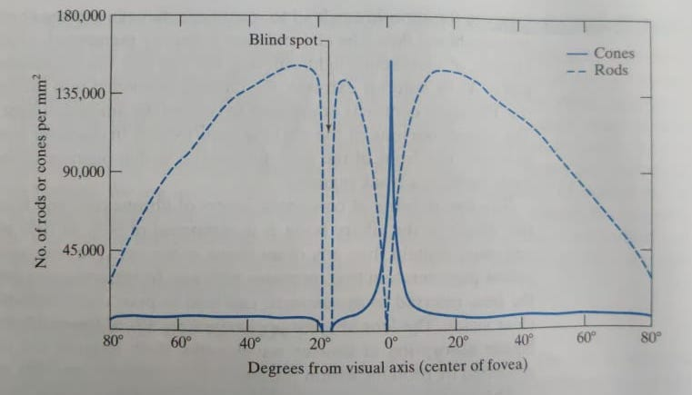
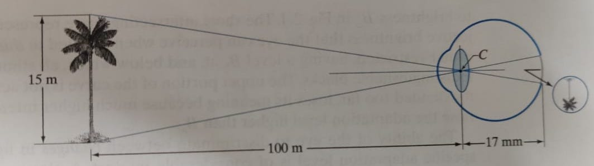

# Chapter-2 Digital Images Format 

## 2.1 - Elements of Visual Perception

### 28-01-2022 

### The Structure of the eye 
The eye is really a wonder of nature, so perfect it works, and I am going to start my new journey studying a bit about this beautiful machine. How humans percieve
vision is of a great interest to us. The human eye has 3 membrane structure, one of them is retina, which forms the part of the eye where the images are 
formed inside the eye. It percieves this image and sends the signal to the brain (how brilliant). 

The light perception happens in the **retina** region of the eye. which lines the inside walls of the poserior region. It has two types of receptors, cones and rods. It's also very interesting to see how these two acts as two dfferent types of receptors. 

 **Cones**
- There are about 6-7 million in numbers, mostly located in the central region of the retina (known as Fovea, also check the diagram below)/
- They are highly sensitive to the color. 
- Each cone is connected to a nerve end and hence they can resolve fine details of the scene. 
- Cone Vision is known as <i>photopic</i> or <i>bright light vision</i>.

**Rods**
- There are about 75 to 150 million rods present in each eye (yes, much much larger)
- They don;t have a separate nerve ending for each cell and several rods are connected to a single nerve ending, th is reduces the information that is carried forward and hence rods capture the overall image of the field of view. 
- They are not involved in color visoin and are sensitive to low levels of illumination. 
- Rods vision is known as <i>scotopic </i> or <i>dim-light </i>

"Objects that appear colored during the day, appear as colorless forms in the moonlight" and now you know why, because for the latter, only the rods are stimulated. 

Also, what I refer to it as, that rods and cones capture different qualities of the scene, cones is much more interested in capturing the color, brighness and hue of the scene, where rods capture the shapes, distance and other basic characterisitics of the scene. 

**Figure 2.2**
 

The above figure shows the density of cones and rods in the cross-section of the right eye. 
- The disitribution is almost symmetrical about Fovea (present at 0 degrees), but there is a point at around 20 degrees (left of Fovea in the figure) called the blind spot. This is the region where optic nerve is connected to the eye and hence, no receptors are present at this region. 
- The Fovea here represents a circular region in the retina and has an area of about 1.7 mm squares. 
- Cones are mostly located in the center area of fovea. 
- Rode are more uniformly located then cones, their density increases in density from center out to approximately  off axis. Then, their density decreases out to the periphery of the retina.

One interesting thing to note here is that the fovea contains about 265,000 cones. So, this much amount of ligh sensors. It's many isn't. But here comes the interesting thing, **Most electronic imaging chips exceed this number by a large factor**.

### 09-02-2022 

### Image Formation in the eye 
- There's a difference between how an ordinary photographic camera focusses on object to how an human eye would do it. 
- In case of a camera, the lens has a fixed focal lenght and the image is formed on the film (imaging chip, or retina of the camera) by varying the distance between the lens and the film. 
- However in the case of human eye, this distance is fixed (between the lens and retina). In this case, the image is formed on the retina by chanding the shape and hence the focal length of the lens is adjusted such that image is formed on the retian. 
- And this happens so effortlessly. If you are seeing the screen right now, and just look at the background (wall or whatever) then the eye will automatically change the focal length of the eye such that the image is formed on the back of retina, isn't brilliant, how efforotlessly it happens. 
- The next cool thing is that we can also find the length of the image formed inside the retina. 

One can even try it practically, if you know the length of the screen in front of you and also the distance of the screen from the eyes, then using hte formulae in the above image we can calculate the length of the intverted image formed in the retina. 

### Brightness Adaptation and Discrimation

Whenever we go to movies, and enter the theater, it takes some time for the eyes to adjust and before that everything appears very dark. But after some time, we are able to see the different compoenents inside the theater, like the stairs and the curtains, which was not visible before. This is the phenomenon we are going to study in this section. 

The human eye can adapt to a large intensity levels, from the scotopic limit to the glare limit. 

As we have seen in the previous section that vision perception is done through cones and rods and the type of vision is named as photopic and scotopic vision respectively. 

In the graph below, we can see that there is a logarithmic relationship between the subjective brightness (intensity as percieved as the human visual system) and light intensity incident on the eye. 
